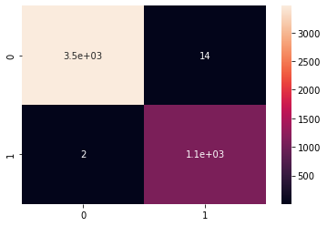
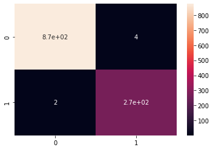
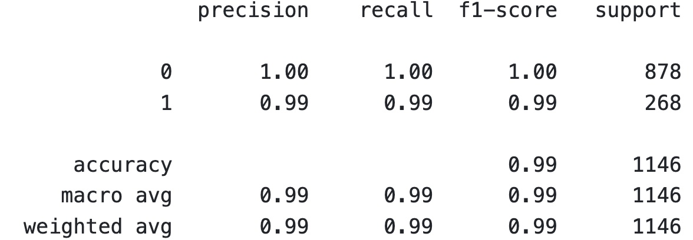

# spam_classifier_naive_bayes
Using Naive Bayes to classify whether a message is spam or not  
To view the Notebook code and visualization: [Click here](https://github.com/lizhiyidaniel/spam_classifier_naive_bayes/blob/main/spam_classifier_naive_bayes.ipynb)
To view the post from my website: [Click here](https://lizhiyidaniel.github.io/2021/12/01/spam_classifier_naive_bayes.html)
## Background:
Naive Bayes is a popular rstatistical technique for e-mail filtering. It uses bag-of-words features (use countvectorizer to create the features from the text) to identify the email spam.  
It uses a Bayes' theorem to calculate a probability that an email is spam or not and it usually has low false positive spam detection rates, meaning that it rarely misclassify an legitimate email as spam. However, as its name suggest, it assumes strong and naive assumption about the independence of the words, which is rarely the case for words in the context. 

## Results:
Training results:

Testing results:

Precision, Recall, and F1 score for testing results

